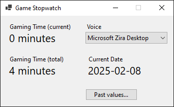

# GameStopwatch

Stopwatches/timers are defined by key(press), time and sound that is played.
On keypress event timer is started and after specified time the sound (voice command) will be heard.
That way player can be prepared to collect items that appear on some schedule.

## TODO
- [x] FrmPastValues:
	- [x] Chart should display only filtered rows
	- [x] Add check box: Include current date and gametime
	- [x] Remove Filter: button or item in cmbFilter
	- [x] Always display Count, Avg in status bar
- [x] New screenshots
- [ ] Code refactoring
