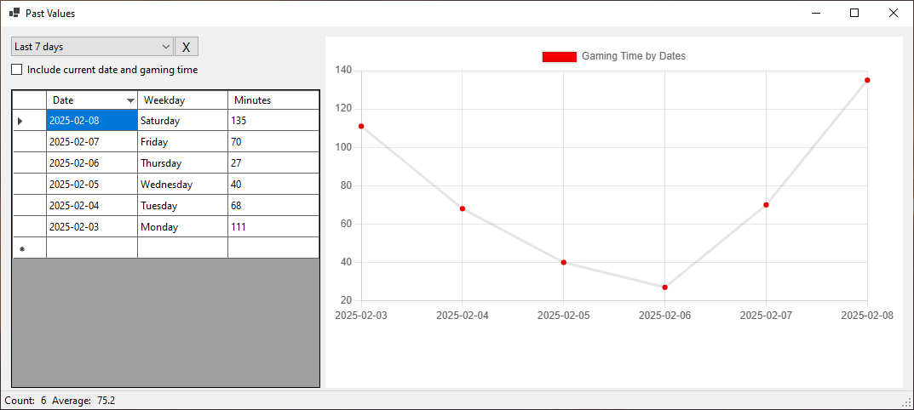

# GameStopwatch

Stopwatches/timers are defined by key(press), time and sound that is played.
On keypress event timer is started and after specified time the sound (voice command) will be heard.
That way player can be prepared to collect items that appear on some schedule.
Time spent in game is shown in table and chart form.

## TODO
- [x] Sounds should play async
- [x] Time spent forms other than FrmMain should not count
- [x] Days without any gaming time will have zeros instead of being skipped
- [ ] Code refactoring
